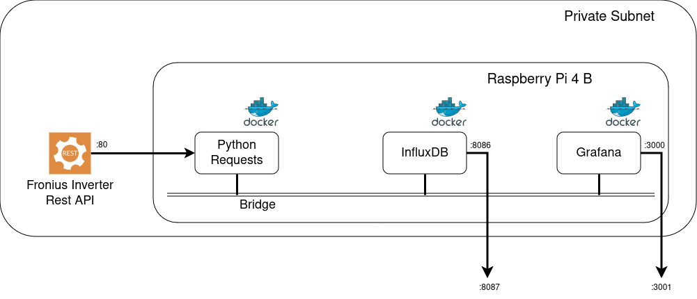

# Fronius-To-InfluxDB

Request data from Fronius inverter's Rest API and store it in the 
InfluxDB for visualization in Grafana. This application collects the most basic 
Fronius inverter data for a most basic setup. If your installation is 
more advanced, some extra work may be reqired, though. 

# Fronius Endpoints 
This application collects data from the following endpoints (Symo GEN24 6.0).
Adjust fronius host and path accordingly (see parameter.json)

    "http://{0}{1}GetInverterRealtimeData.cgi?Scope=Device&DataCollection=CommonInverterData&DeviceId=1".format(fronius_host, fronius_path)
    "http://{0}{1}GetStorageRealtimeData.cgi?Scope=Device&DeviceId=0".format(fronius_host, fronius_path)
    "http://{0}{1}GetMeterRealtimeData.cgi?Scope=Device&DeviceId=0".format(fronius_host, fronius_path)

# Installation 
The current installation runs on a Raspberry Pi 4 B (with 4 GB RAM and a 64 GB SD)
inside a Docker landscape. 

    cd docker
    docker-compose build
    docker-compose up -d

Please create the token files inside 
[docker/data/secrets](https://github.com/Tamburasca/fronius2influx/blob/426322986a35a77106e53a78811118613b7ca29a/docker/data/secrets) 
appropriately. The tokens for influxDB are visible after first start in the 
docker-compose logs.

# Visualization
Grafana 
[dashboards](https://github.com/Tamburasca/fronius2influx/blob/833969887f417cd0a51fba7c583c9fab22594d61/docker/data/grafana/etc/grafana/provisioning/dashboards) 
and 
[influxDB](https://github.com/Tamburasca/fronius2influx/blob/833969887f417cd0a51fba7c583c9fab22594d61/docker/data/influxdb2/explorer) flux statements are available. 

